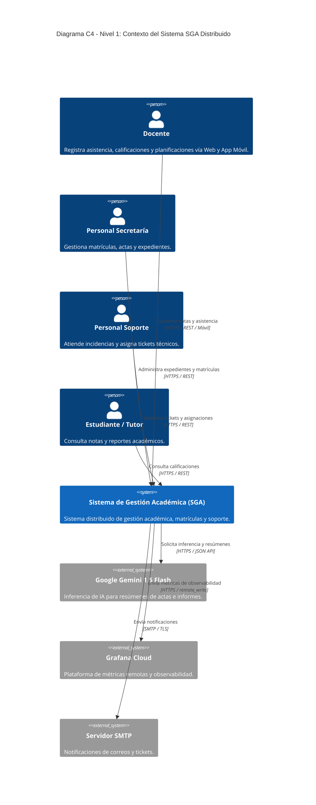
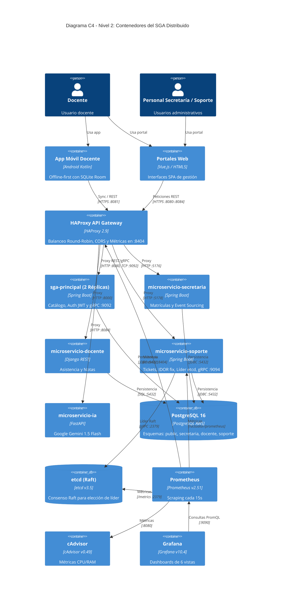
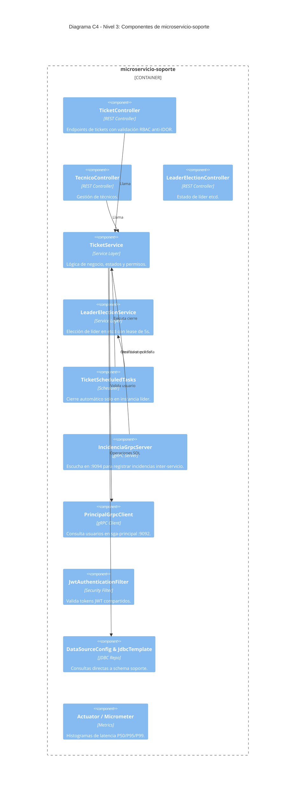

# Diagramas de Arquitectura C4 - SGA Distribuido

Este directorio contiene los diagramas arquitectónicos del **Sistema de Gestión Académica (SGA Escuela Provincias Unidas)** estructurados bajo el modelo **C4 (Contexto, Contenedores, Componentes y Código)**.

---

## 1. Nivel 1: Diagrama de Contexto del Sistema

Describe los actores que interactúan con el SGA y los sistemas externos que forman parte de la solución.

---

## 2. Nivel 2: Diagrama de Contenedores

Describe las aplicaciones, microservicios, bases de datos y herramientas de monitoreo desplegadas en contenedores Docker.

---

## 3. Nivel 3: Diagrama de Componentes de `microservicio-soporte`

Detalla la arquitectura hexagonal/por capas del microservicio de soporte técnico asignado.

